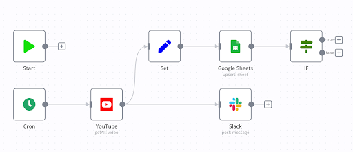

In some scenarios, Callgent offers functionality similar to automation tools. It's often confusing why yet another tool is needed.

Callgent goal is to break the silos among Users and systems.
Let's take a look at the differences between Callgent and other automation tools.

## Major Automation Tools on the market

There are many automation tools available on the market, e.g.,

<!-- truncate -->

- [IFTTT](https://ifttt.com)
- [Zapier](https://zapier.com)
- [Microsoft Power Automate](https://powerautomate.microsoft.com)
- [Integromat](https://www.integromat.com)
- [Workato](https://workato.com)
- [tray.io](https://tray.io)

also some of the open source tools,

- [n8n](https://n8n.io)
- [Huginn](https://github.com/huginn/huginn)
- [Node-RED](https://nodered.org)

All of them enable you to define workflows and connect them to various services.

While the usage scenarios are similar to Callgent, the ways they achieve these are fundamentally different.

## Workflow Centric vs Service Centric

One of the key differences between Callgent and other major automation tools is the approach to workflows and services.

### Workflow Centric

The majority of automation tools take a workflow-centric approach. This places the workflows as the central element of the automation, meaning the primary focus is on the sequence of events and operations that need to be performed. Users define the steps and prescribe precisely what should happen and when.

### User and Service Centric

On the other hand, Callgent champions a service-centric approach. Instead of concentrating solely on workflows, Callgent aims to enhance the interactivity and collaboration between users and systems. It emphasizes creating an ecosystem where services can interact more dynamically and intuitively with users. By breaking down the silos between different services and users, Callgent facilitates a more integrated and responsive automation environment.

Following this paradigm, you may chat with any system services **freely** just like another friend; conversely, system may invoke a user just like a regular service.

## User Experience & Ease of Use

When it comes to user experience, Callgent prioritizes simplicity and ease of use. With its innovative:

- `Progressive Calling`
- `Request Mapping`

techniques, users can automate tasks effortlessly, even without extensive technical expertise, eliminating the need for complex workflow construction.

In contrast, traditional automation tools often require a deeper technical understanding. Setting up workflows can sometimes be quite complex and require a keen understanding of the services being connected. For power users, this complexity allows for robust and detailed automation, but for casual or non-technical users, it can be a barrier to entry.

## Integration Capabilities

Callgent stands out among automation tools by focusing on deep integration rather than simply connecting services. It goes beyond surface-level integration, ensuring seamless cohesion within the broader ecosystem and accounting for each service's unique features and nuances. Furthermore, Callgent offers the flexibility to integrate as a standard microservice into native systems, allowing businesses to harness its capabilities within their existing infrastructure.

Other automation tools are generally more concerned with the breadth of services they can connect. They may support a larger number of integrations, but sometimes the integration is more surface level, enabling basic tasks but lacking deeper functionality that may be necessary for more complex or specialized needs.

## Conclusion

In the landscape of automation tools, Callgent stands out by offering a user-friendly, service-centric approach that aims to blur the line between user and service interaction. While other tools excel in creating complex, multi-step workflows, Callgent encourages a new way of thinking about automation, one that enhances the user experience by focusing on deep service integrations and natural interactions.

Callgent redefines collaboration, merging human intuition with digital efficiency. Imagine creating in ways you never thought possible.

Overall, our goal is to place everything on the same platform, especially emphasizing the seamless integration of the

- "Service as a Callable Agent"

concepts.
