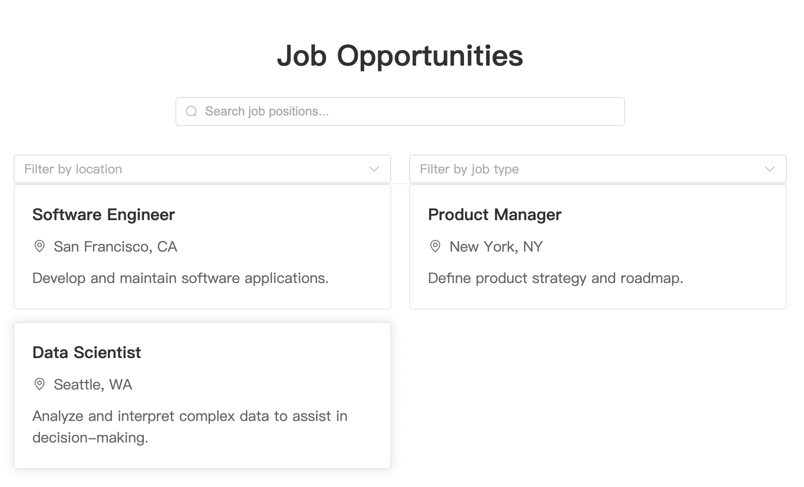

Callgent's vision is to empower everyone to easily define and integrate software API services, enabling us to create our own apps effortlessly.

In the world of SaaS, every service provider exposes their services as APIs, making it convenient for us to integrate them into our own apps. With the power of AI agents, we no longer need to rely on developers. Anyone can use Callgent to quickly assemble their own app.

Let's dive in and build a recruitment app without any coding! The process is simple and consists of four steps:

1. **Define Your App Functionality**
2. **Import Functionality API Files into Callgent**
   - Callgent will automatically generate the app pages.
3. **[Callgentive User Interaction](generative-ui-home-cooked-software-development)**
   - When users interact with the app pages, Callgent will automatically send you an email.
4. **Display Responses**
   - Your replies will be automatically displayed on the app pages.

For a hands-on experience, [click here](../docs/quick-start/build-web-app).

:::note
In this example, you yourself act as the server for the app, responding to each request.
:::

In reality, you can directly integrate existing SaaS services into your app (e.g., integrate [Auth0](https://auth0.com/docs/api) for user registration and login, or integrate [Zoom](https://developers.zoom.us/docs/api/) for online meetings). For more service options, please refer to the [Callgent hub](#).

Remember, Callgent helps you easily integrate various SaaS services and quickly generate interfaces (webpages, chatboxes, emails, Slack channels, etc.), allowing users to freely use the apps you create.

## Showcase

Here's a quick result of our recruitment app, using GPT-4o:

Generated code is available [here](https://codesandbox.io/p/sandbox/vue3-forked-d897c8).