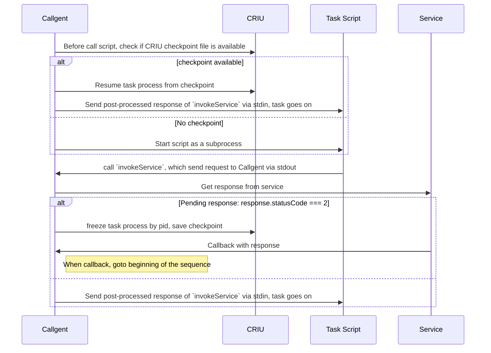

# Persistent Async Calls

Depending on [CRIU](https://criu.org/Main_Page) support, Callgent can be configured to use persistent asynchronous calls.

## Workflow Design

```mermaid
sequenceDiagram
    participant Callgent
    participant CRIU
    participant Task Script
    participant Service
    Callgent->>CRIU: Before call script, check if CRIU checkpoint file is available
    alt checkpoint available
        Callgent->>CRIU: Resume task process from checkpoint
        Callgent->>Task Script: Send post-processed response of `invokeService` via stdin, task goes on
    else No checkpoint
        Callgent->>Task Script: Start script as a subprocess
    end
    Task Script->>Callgent: call `invokeService`, which send request to Callgent via stdout
    Callgent->>Service: Get response from service
    alt Pending response: response.statusCode === 2
        Callgent->>CRIU: freeze task process by pid, save checkpoint
    Service->>Callgent: Callback with response
        note right of Callgent: When callback, goto beginning of the sequence
    else
        Callgent->>Task Script: Send post-processed response of `invokeService` via stdin, task goes on
    end
```
