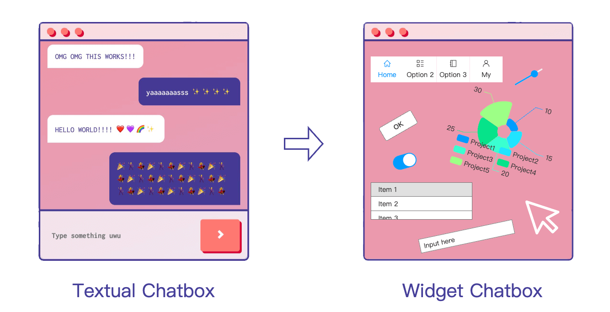
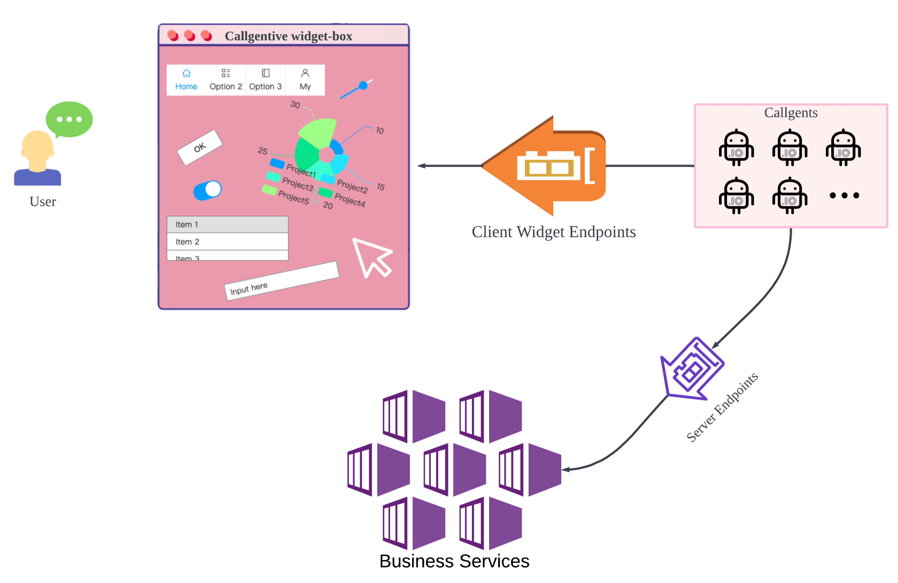

AI Large Language Models (LLMs) are ushering in a new golden age of [Home-Cooked Software](https://maggieappleton.com/home-cooked-software). and callgent is providing the solid infrastructure and solutions to make it happen. Let's take a look at how.

## What is Generative UI?

From now on, forget the traditional software paradigm.

Imagine if we treated every interaction between a user and an app as a chat, with the only difference being that the content of the chat is not text, but rather a collection of widgets.

<figure>

</figure>

Users interact with widgets to send chat requests to AI agents, which then decide how to process the request, encapsulate the result in widgets, and present it to the user in a certain way.

The underlying layer of the chat is still textual + agents, but the interaction between the user and the app will now take place through a visual widget UI instead of text.

:::tip
From the end-user's perspective, a Generative App is no different from a traditional app (although a Generative App may appear more personalized).
:::

## Callgentive UI

How does callgent leverage generative UI, as we name it `Callgentive UI`.

A picture is worth a thousand words:

<figure>

</figure>

With predefined business services and standard widgets, the `Home-Cooked Software` works as follows,

- The landing pages are generative UI of widgets generated from some initializing Agent prompts.
- As user interacts with the widgets, the interactions are transformed into a chat request.
- The backend Callgent maps the chat requests to business service invocations, and gets response data from services.
- The Callgent makes the response data into a set of widgets, and presents it to the user.

### How does it work?

Callgent's core functionality is to do native function-calling to orchestrate business services.

Callgent has server endpoints and client endpoints to adapt various invocation scenarios.

Specifically, widget based User Interface, is just one more type of client endpoints, to adapt human interactions.
