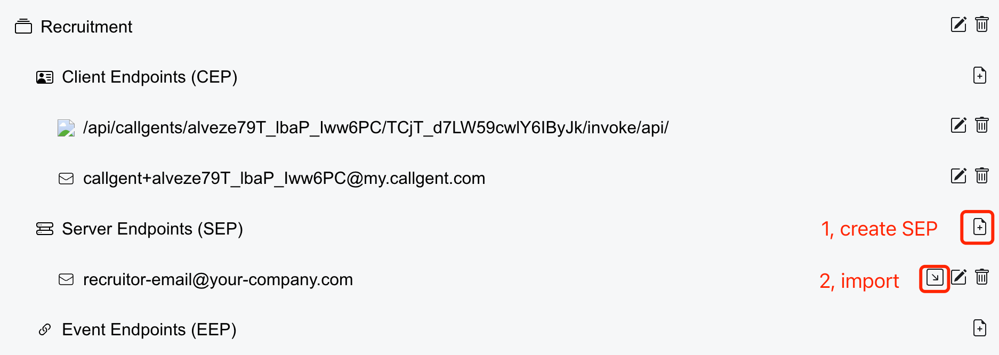

import CreateEntries from "@site/src/components/user-as-a-service/create-entries"
import CreateCallgent from "@site/src/components/user-as-a-service/create-callgent"
import ImportApi from "@site/src/components/user-as-a-service/import-api"
import Email from "@site/src/components/quick-start/email"
import CascadingMenu from "@site/src/components/tree"

We are ready to create the recruiting callgent, then import the API document into the callgent.

## Create a new callgent

We can use the following widget to create a new callgent,

{/* <pre><CreateCallgent /></pre> */}
<CascadingMenu adaptorKey="Email" name="Recruitment" />

A callgent contains:

- a list of `Client Entries`  
    to accept calling requests to the callgent,
- a list of `Server Entries`  
    to forward the calling requests to the actual services,
- a list of `Event Entries`  
    callback hooks from actual service.

## Import the API document

After creating the callgent, we may create an `SEP`, then import the API document into it:

1. Click `Create SEP` button,
2. Here we create an Email SEP, fill in your Email address,  
    Every incoming call request will be sent to this Email address
3. Click `Import API` button to import the API document into the SEP.

<figure>

</figure>

Creating recruiting callgent is all done.  

## Invoking the callgent

Now you may call this new service anywhere by every `CEP` as show in the callgent,

### Invoking REST API:

try invoke `List all job positions` API as follows,

```shell
curl https://api.callgent.com/api/rest/invoke/{callgentId}/{clientEntryId}/positions
```

### Sending Email

or by sending an Email to  
<a href="mailto:callgent+{yourCepId}@my.callgent.com?subject=Please%20Respond%20Calling%20to%20`List%20all%20job%20positions`&body=I%20am%20requesting%20to%20call%20`List%20all%20job%20positions`.%20Please%20respond%20to%20this%20Email%20with%20the%20calling%20request%20details.">callgent+yourCepId#my.callgent.com</a>

### More calling entries

You may create more `CEN`s to accept calling requests to the callgent, e.g. `SIP`, `WebRTC`, `SMS`, etc.  
