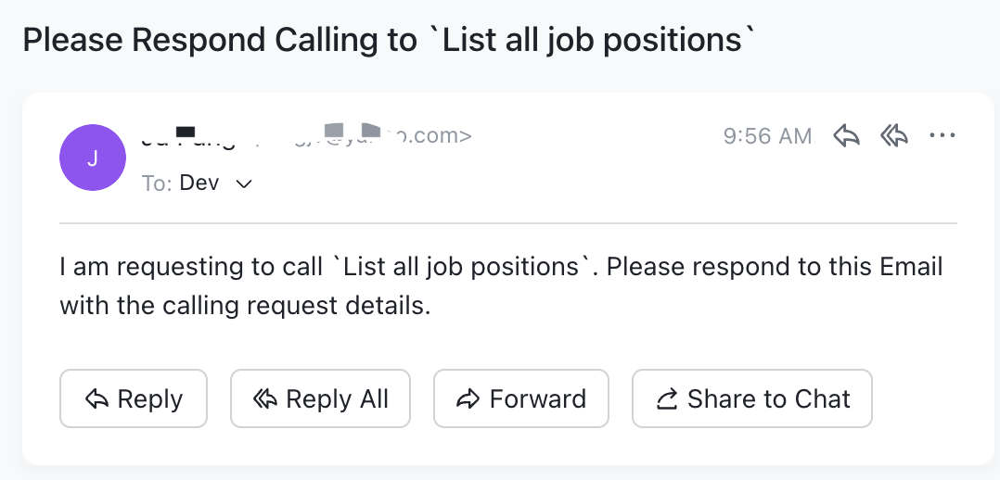

In this UaaS case, you are acting as a service to respond to every invocation, which comes from your previously created Email `SEP`.

So every calling to the callgent service, you will receive an email like this:

<figure>

</figure>

## Respond to the call

Just reply to this email, for example:

```plaintext
Subject: Job Positions Available

Dear [Recipient's Name],

We are pleased to inform you about the following job positions available at our company:

1. Software Engineer
   - Description: Develop and maintain software applications.
   - Location: San Francisco, CA
   - Requirements:
     - Bachelor's degree in Computer Science or related field
     - 3+ years of experience in software development
     - Proficient in Java or Python
   - Created At: October 1, 2023, 12:00 PM
   - Updated At: October 1, 2023, 12:00 PM

2. Product Manager
   - Description: Define product strategy and roadmap.
   - Location: New York, NY
   - Requirements:
     - Bachelor's degree in Business or related field
     - 5+ years of experience in product management
     - Strong analytical and problem-solving skills
   - Created At: October 2, 2023, 10:00 AM
   - Updated At: October 2, 2023, 10:00 AM

3. Data Scientist
   - Description: Analyze and interpret complex data to assist in decision-making.
   - Location: Seattle, WA
   - Requirements:
     - Master's degree in Data Science or related field
     - 2+ years of experience in data analysis
     - Proficient in Python and SQL
   - Created At: October 3, 2023, 8:00 AM
   - Updated At: October 3, 2023, 8:00 AM

Please review the details and let us know if you are interested in any of these positions.

Best regards
```

## Formal response received by the caller

The caller then receives the response from the callgent service,

### If calling by Email

He may receive the exactly same email as above.

### If calling by REST API

the formal response generated by Callgent is,

```json
[
  {
    "id": "1",
    "title": "Software Engineer",
    "description": "Develop and maintain software applications.",
    "location": "San Francisco, CA",
    "requirements": [
      "Bachelor's degree in Computer Science or related field",
      "3+ years of experience in software development",
      "Proficient in Java or Python"
    ],
    "createdAt": "2023-10-01T12:00:00Z",
    "updatedAt": "2023-10-01T12:00:00Z"
  },
  {
    "id": "2",
    "title": "Product Manager",
    "description": "Define product strategy and roadmap.",
    "location": "New York, NY",
    "requirements": [
      "Bachelor's degree in Business or related field",
      "5+ years of experience in product management",
      "Strong analytical and problem-solving skills"
    ],
    "createdAt": "2023-10-02T10:00:00Z",
    "updatedAt": "2023-10-02T10:00:00Z"
  },
  {
    "id": "3",
    "title": "Data Scientist",
    "description": "Analyze and interpret complex data to assist in decision-making.",
    "location": "Seattle, WA",
    "requirements": [
      "Master's degree in Data Science or related field",
      "2+ years of experience in data analysis",
      "Proficient in Python and SQL"
    ],
    "createdAt": "2023-10-03T08:00:00Z",
    "updatedAt": "2023-10-03T08:00:00Z"
  }
]
```
