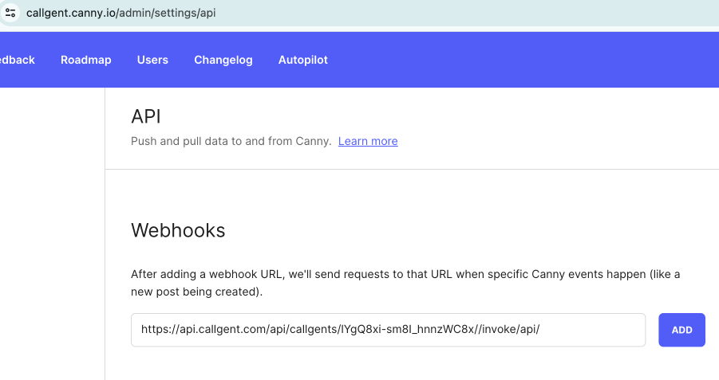

## Scenarios

The callgent you create is no more than the delegate to a business service. It receives requests from `Client endpoint`s (CEP), then maps the requests to specific `Server Endpoint`s (SEP) to do invocation to the actual business service.

There is one more scenario, where the actual business services may have several internal Service `Event`s to notify users/clients, usually via `webhook` or emails.

Callgent provides `Event Endpoint`s (EEP) to receive these events.

<figure>

</figure>

:::info difference between CEP and EEP
Both `CEP`s and `EEP`s accept requests. The difference is that, `CEP`s directly map requests to `SEP`s, while `EEP`s only publish request events to registered event listeners.
:::

:::note
You may also treat service events notification as normal client calls. In this case, you can configure `CEP` URLs as webhook address in business services.
:::

## Try it yourself

Let's try it by configuring webhook as a `CEP`.

import CreateCallgent from "@site/src/components/user-as-a-service/create-callgent"

## Create a callgent

First create a callgent:

<pre><CreateCallgent name="Webhook Demo" /></pre>

## configure CEP as Webhook url

By default, a callgent has 2 `CEP`s:

- Email CEP: accepts requests by email
- API CEP: accepts requests from REST API

and 1 Email `SEP`: which will relay every request to your account Email address.

Just copy the `CEP` address, paste into your service webhook configuration.

For example, paste the API `CEP` address into canny.io:

<figure class="col col--8">

</figure>

:::success
Now you can receive all notifictions from you account Email.
:::

:::info
If you want to handle these notifications, you may add another `SEP` or orchestrate another `callgent` to complete your business workflow.
:::
